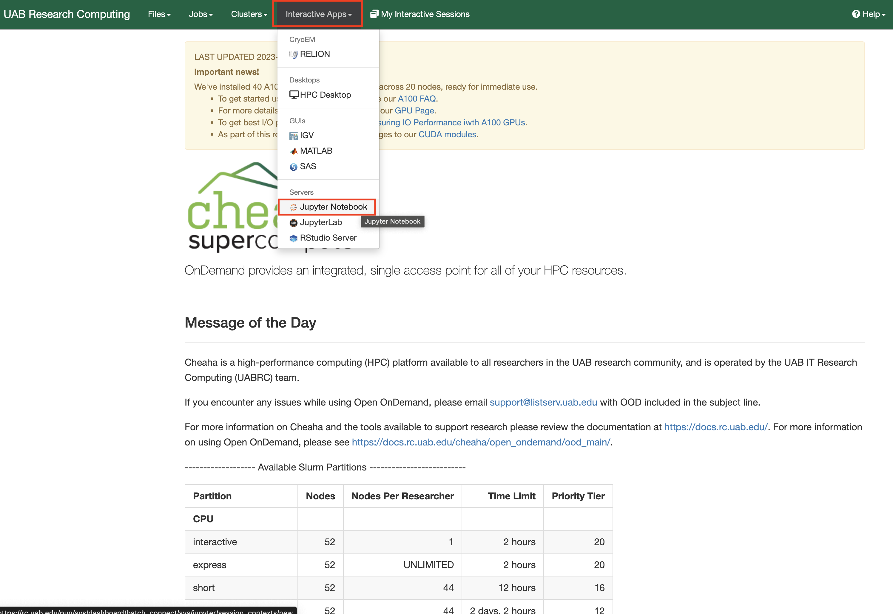
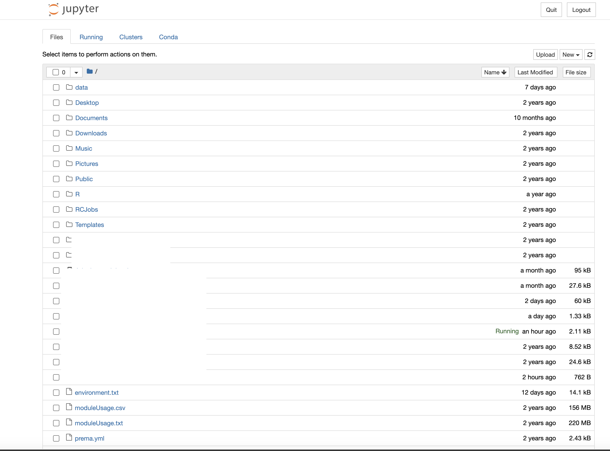
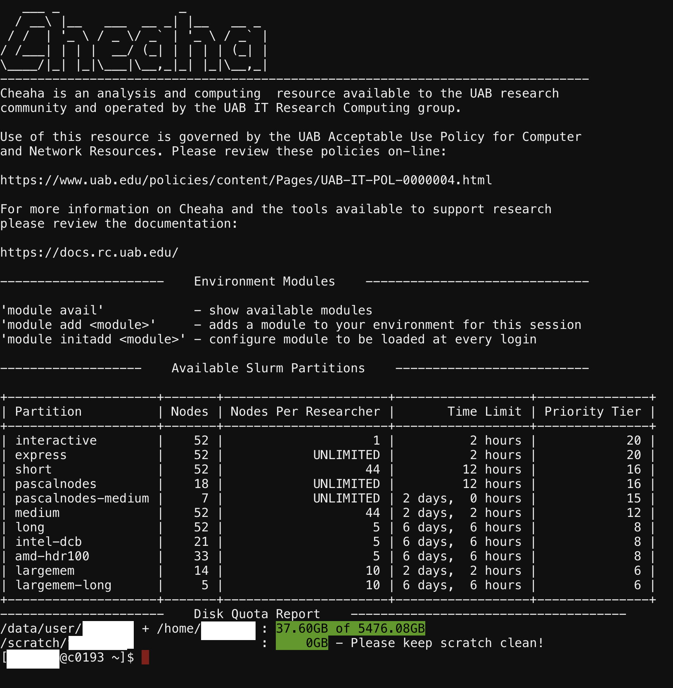
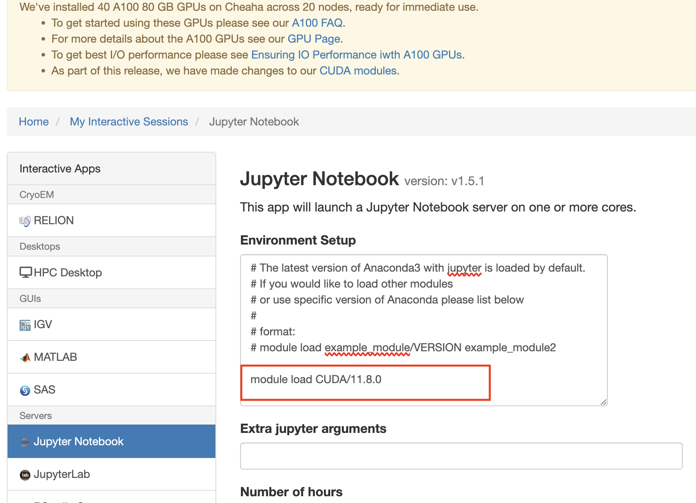

# `conda` Environment Tutorial for PyTorch and TensorFlow

The below tutorial will show you how to create a `conda` environment, activate, and install libraries/packages for machine and deep learning (PyTorch and Tensorflow) using a `conda` environment on Cheaha. There are also steps on how to access the terminal, as well as using Jupyter Notebook's Graphical User Interface (GUI) to work with `conda` environments. There are detailed steps here to guide your creation of a [Jupyter Notebook job.](../open_ondemand/ood_layout.md#interactive-apps)

## Installing `conda` Environments Using the Terminal

To access the terminal (shell), please do the following.

1. Login to [rc.uab.edu](https://rc.uab.edu)

1. Create a job on Cheaha using the Interactive Apps dropdown option.

1. Select Jupyter Notebook, and fill out the options, as per your project needs, then click Launch.  For more information on compute needs, and a guide for selecting the right options click [here](../job_efficiency.md#estimating-compute-resources). 

1. Click the Connect to Jupyter button 

    You will see the below interface. 

1. When the job has been created, on the My Interactive Sessions page, click the button in front of Host (usually colored blue) in the format >_c0000.

    

    This should open into a terminal as shown below.

    

1. In this interface, you can create, and activate environments, as well as install packages, modules and libraries into your activated environment.

## How do we create a custom environment for PyTorch and TensorFlow

The instructions below, provide a recommended step by step guide to creating and activating an environment that has PyTorch and/or TensorFlow installed and ready to use for deep learning projects.

## Installing PyTorch Using the Terminal

There are two instances of PyTorch that can be installed, one requiring GPUs, and another utilising only CPUs. GPUs generally improve project compute speeds and are preferred. For both instances of pytorch, please follow these steps;

1. [Create](../../workflow_solutions/using_conda.md#create-an-environment) and [activate](../../workflow_solutions/using_conda.md#activate-an-environment) an environment as stated in these links.

1. Access the terminal following the steps [here](#installing-conda-environments-using-the-terminal).

<!-- markdownlint-disable MD046 -->
!!! note

    When installing packages, modules and libraries into environments, remember to also install `ipykernel` using `conda install ipykernel`. This way your activated environment would appear in the list of kernels in your Jupyter Notebook.

<!-- markdownlint-enable MD046 -->

For a correct installation of pytorch, we have to ensure some conditions are met. See partition [docs](../hardware.md#details) for a guide. One of such conditions, is to load CUDA toolkit using the below command in your environment setup form (see image below).

```bash
module load CUDA/11.8.0

```



<!-- markdownlint-disable MD046 -->
!!! note

    The cudatoolkit version may vary, as at the time of this tutorial, 11.8 is the version used. Running `nvidia-smi`, as in the image below, will show you the status, version and other information on GPUs in your created job session. The CUDA version is highlighted. The GPU CUDA Version available on Cheaha at the time of this tutorial is 12.3. Because the toolkit version used is lower than the Cheaha GPU version, it works.

<!-- markdownlint-enable MD046 -->


When your job has been created and your environment created and activated from the terminal (see above [instructions](../../workflow_solutions/using_conda.md#create-an-environment)), run the below command.

```bash
conda install pytorch torchvision torchaudio cudatoolkit=11.8 -c pytorch -c nvidia

```

This commands will install a GPU compatible PyTorch version into your environment. To verify PyTorch is installed, and to see what version you have installed in your environment, use the below command.

```bash
conda list | grep "torch"

```

You should get an output like the below image.


The same process can be followed for installing another Deep Learning library Tensorflow (see instructions [below](#install-tensorflow-gpu-using-the-terminal)) with some minute differences. You may decide to install the TensorFlow library into the same environment or create a new one. As a best practice, you may want to install these libraries in different environments.

## Using PyTorch on Jupyter Notebook

As an example we will be using a sample Jupyter Notebook with just a simple torch function to test if a GPU will be utilized with PyTorch functions. Run the command in a cell, and if your output is `True`, then you have your GPU setup to support PyTorch functions.

```python
import torch

print(torch.cuda.is_available())
x = torch.cuda.current_device()
print(torch.cuda.get_device_name(x))

```


## Install TensorFlow GPU Using the Terminal

1. Create a new environment that is compatible with supported tensorflow versions, use the below command to do this. For this tutorial we will use Python 3.11.

    ```bash

    conda create -n tensorflow python=3.11

    ```

1. The TensorFlow CPU and GPU versions requires pip to be up-to-date, to install and upgrade pip to the latest version use the below command.

    ```bash

    pip install --upgrade pip

    ```

1. Install TensorFlow with pip

    ```bash

    pip install tensorflow[and-cuda]

    ```

The image below shows an output that the TensorFlow library will utilize the available GPU.


<!-- markdownlint-disable MD046 -->
!!! note

    The information (I) and warning (W) outputs notifies you of the installed Tensorflow binary and how it would function. The I output informs you that the installed Tensorflow library will utilize your CPU for additional speed when GPUs are not the most efficient way to do processing for these operations. The W output tells you TensorRT is not available, please note TensorRT is not currently supported on our systems.
<!-- markdownlint-enable MD046 -->

Now that you have completed the tutorial, you can find more `conda` information at our [Using `conda` page](../../workflow_solutions/using_conda.md#why-use-conda).
