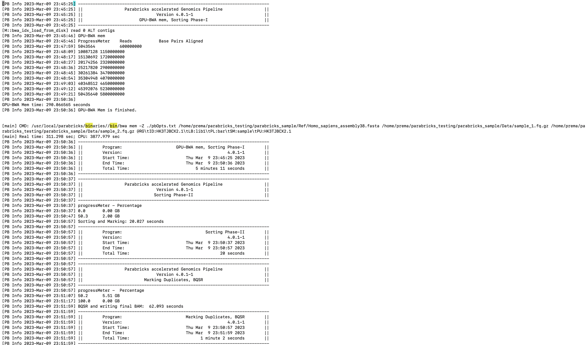
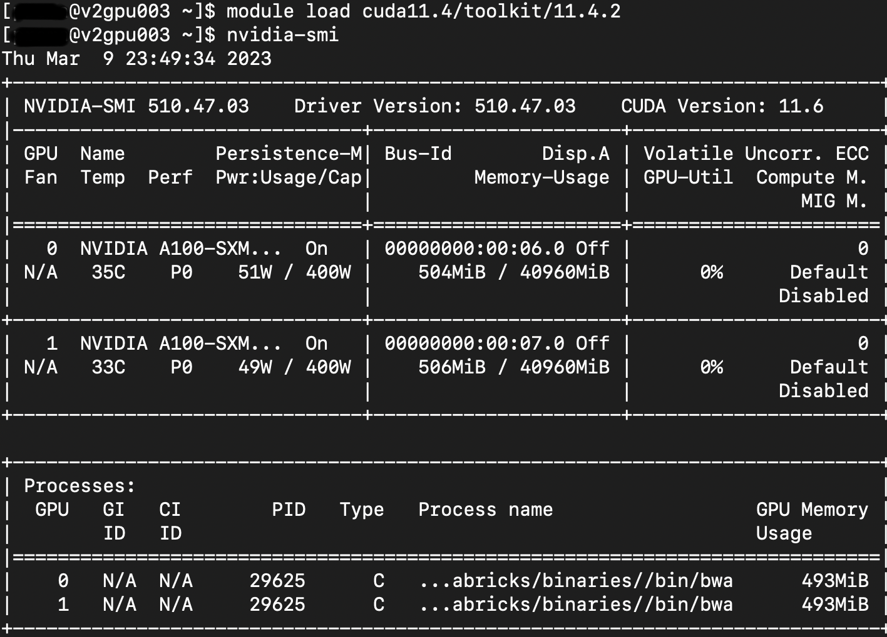

# Case Studies

## Parabricks for Performing GPU-accelerated Genome Sequencing Analysis

A GPU-accelerated genome sequencing analysis with high speedup and more accurate results can be achieved with NVIDIA Clara Parabricks. Pararbricks is a software suite for genomic analysis. Parabricks delivers accelerated analysis of next generation sequencing (NGS) data for researchers, RNA-seq, population studies, and many more usecases. More insights on its performance can be found [here](https://resources.nvidia.com/en-us-genomics-ep/healthcare-genomics-?lx=OhKlSJ).

### Licensing Policy

A license is no longer required to use Clara Parabricks 4.x and later versions, and is free for the following groups,

1. Academic Research.
2. Research by non-profit institutions.
3. For development, test and evaluation purposes without use in production.

### Minimum Hardware requirements to run Parabricks on GPUs

1. Access to internet.

2. Any GPU that supports CUDA architecture 60, 61, 70, 75 and has 12GB GPU RAM or more. It has been tested on NVIDIA V100, NVIDIA A100, and NVIDIA T4 GPUs.

#### System Requirements

(i) 2 GPU server should have 100GB CPU RAM, at least 24 CPU threads.

(ii) 4 GPU server should have 196GB CPU RAM, at least 32 CPU threads.

(iii) 8 GPU server should have 392GB CPU RAM, at least 48 CPU threads.

## Parabricks Testing on Cheaha

Parabricks software can be installed and used in the Cheaha platform on `pascalnodes` and `amperenodes` partition. The `amperenodes` partitons are currently a special queue on Cheaha and are available to users upon request based on project specification.

### Parabricks 4.x Installation on Cheaha

Parbaricks 4.x are available as containers in the [NGC Catalog](https://catalog.ngc.nvidia.com/orgs/nvidia/collections/claraparabricks/entities), and Parabricks 4.0.0 documentation is available [here](https://docs.nvidia.com/clara/parabricks/4.0.0/index.html). It has generic container that comprises all the analyses pipeline that are referred in the [Nvidia Documentation](https://docs.nvidia.com/clara/parabricks/4.0.0/toolreference.html). It also has containers for specific tool category.

Parabricks 4.x container image can be installed on Cheaha using Singularity container. More details on usage of Singularity container on Cheaha can be found in the [Containers Page](../workflow_solutions/getting_containers.md).

To install Parabricks using Singulairty, load the `Singularity 3.x` module from Cheaha as,  

```bash
module load Singularity/3.5.2-GCC-5.4.0-2.26
```

Go to the NGC catalog page and copy the image path to pull the desired containers of Parabricks using Singularity. Here, the generic container is pulled using Singularity.  The image path is in “nvcr.io/nvidia/clara/clara-parabricks" and the tag is 4.0.1-1. The container image name `parabricks.sif` is an user-derived name.


```bash
singularity pull parabricks.sif docker://nvcr.io/nvidia/clara/clara-parabricks:4.0.1-1
```

After the image `parabricks.sif` is successfully created, you can run singularity image “parabrikcs.sif” with all input and output parameters. Various ways of running singularity image can be found in the [Containers Page](../workflow_solutions/getting_containers.md).

Running `singularity shell` helps to navigate through the containers directory to verify the path of the software executable and later use the path outside the container to run the software. Following are the commands to run the container using `singularity shell` and traverse through the directories inside the contianer.

```bash
singularity shell parabricks.sif 
```

```bash
Singularity> ls /bin/pbrun     
/bin/pbrun 
Singularity> /bin/pbrun --version 
Please visit https://docs.nvidia.com/clara/#parabricks for detailed documentation 
pbrun: 4.0.1-1 
```


If the above commands are successfully executed, then the Parabricks software is installed correctly.

### Downloading Pararbicks Sample Use Case

Sample test case for Parabricks can be found [here](https://docs.nvidia.com/clara/parabricks/4.0.0/tutorials/gettingthesampledata.html). Download the sample data using `wget`,

```bash
wget -O parabricks_sample.tar.gz https://s3.amazonaws.com/parabricks.sample/parabricks_sample.tar.gz
```

Untar the `parabricks_sample.tar.gz` file,

```bash
tar -xzvf parabricks_sample.tar.gz
```

### Parabricks Testing on `pascalnodes` and `amperenodes` on Cheaha

Once the sample data is downloaded, you can execute the pipeline using the executable `pbrun` which is located in /bin/pbrun within the container. To run the executable `/bin/prbun` outside the container you need to set the LD_LIBRARY_PATH for the CUDA library and bind it with the container. In the below command, the LD_LIBRARY_PATH of the host environment is passed to the container using environment variable SINGULARITYENV_LD_LIBRARY_PATH.

You will have to load the CUDA toolkit to access GPUs as below.

```bash
module load cuda11.4/toolkit/11.4.2 
```

In the below script, the `--nv` option enables the use of NVIDIA GPUs within the container. The `-B` option is to bind the directories of the host environment and use it within the container. Here the CUDA lib path `/cm/local/apps/cuda/libs/current/lib64` is binded to use within the container. The singualrity container `parabricks.sif` is executed using the command `singualrity run` over the executable `/bin/pbrun`.

```bash
SINGULARITYENV_LD_LIBRARY_PATH=$LD_LIBRARY_PATH singularity run --nv \ 
–B /cm/local/apps/cuda/libs/current/lib64 parabricks.sif /bin/pbrun fq2bam \
--ref parabricks_sample/Ref/Homo_sapiens_assembly38.fasta \
--in-fq parabricks_sample/Data/sample_1.fq.gz parabricks_sample/Data/sample_2.fq.gz \
--out-bam output.bam 
```

You can execute Parabricks on Cheaha using `amperenodes` and `pascalnodes` partition. Maximum number of GPUs you can request in `amperenodes` partition to run Parabricks is 2, and that of `pascalnodes` is 4.  Here is a sample job script to run Parabricks on `amperenodes` partition on 2 GPUs.  

```bash
#!/bin/bash 
#SBATCH --ntasks=24 
#SBATCH --mem=100G 
#SBATCH --time=2:00:00  
#SBATCH --partition=amperenodes  
#SBATCH --job-name=parabricks-ampere  
#SBATCH --gres=gpu:2 
#SBATCH --error=%x-%j_gpu2.err 
#SBATCH --output=%x-%j_gpu2.out 
#SBATCH --mail-user=$USER@uab.edu 

#Load the Singularity and CUDA Toolkit modules
module load Singularity/3.5.2-GCC-5.4.0-2.26 
module load cuda11.4/toolkit/11.4.2 

#Run the "pbrun" executable from the singularity image "parabrikcs.sif", and pass the CUDA lib path to make it accessible within the container
SINGULARITYENV_LD_LIBRARY_PATH=$LD_LIBRARY_PATH singularity run --nv \
-B /cm/local/apps/cuda/libs/current/lib64 parabricks.sif /bin/pbrun fq2bam \
--ref parabricks_sample/Ref/Homo_sapiens_assembly38.fasta \
--in-fq parabricks_sample/Data/sample_1.fq.gz parabricks_sample/Data/sample_2.fq.gz \
--out-bam output.bam 
```

You can also request the required resources using `srun` using the below command, and execute the commands required to run Parabricks.  

```bash
srun --ntasks=24 --mem=100G --time=1:00:00 --partition=amperenodes --job-name=parabricks-ampere --gres=gpu:2 --pty /bin/bash 
```

#### Illustration on `fq2bam` tool analyses

The above execution script performs `fq2bam` pipeline analyses. The `fq2bam` tool aligns, sorts (by coordinate), and marks duplicates in pair-ended FASTQ file data. The data files used in this example are taken from the sample data downloaded in the previous section.

If you execute the above batch script using Parabricks sample data on `amperenodes` with 2 GPUs, the results will be reported as below.



### Monitoring GPU Usage During Runtime on Cheaha

The `nvidia-smi` command helps to montior the GPU usage during runtime. You need to `ssh` to the assigned GPU node, and type in the following command.  

```bash
ssh GPU_node
```

```bash
module load cuda11.4/toolkit/11.4.2
nvidia-smi
```

The `nvidia-smi` reports the GPU memory usage and the 2 GPU process running details as shown below.



### Runtime Evaluation of Parabricks Sample Test Case on `amperenodes` and `pascalnodes` Partition

Empirical results on running Parabricks sample test case on `amperendoes` and `pascalnodes` partitions are illustrated in the below table. For this test case, it seems `pascalnodes` runtime is efficient than `amperenodes`  for 1GPU and 2GPU. However, the real-world science simulations may vary in their speedup.  

{{ read_csv('education/res/parabricks_exec_time.csv', keep_default_na=False) }}

## How to Run Millions of Jobs on OSG: A Case Study

The OSPool is a sharing computing capacity platform in support of Open Science. These resources are accessible to researchers affiliated with a US academic institution. To avail of the OSPool resources, you must obtain an account via [OSG Portal](https://portal.osg-htc.org/). The job to the OSPool is submitted through a high-throughput computing approach (HTC) using HTCondor. HTCondor is a software system that creates a High-Throughput Computing (HTC) environment.

Further guidelines on using Open Science Grid (OSG) for scientific applications, the job compatibility to run on OSG, and examples of submitting HTCondor jobs on OSG access points are found in our [OSG page](../national_ci/osg.md). Please have a look at this page if you are new to OSG.

Numerous jobs such as image analysis, bioinformatics simulation, and molecular interaction benefit from execution on OSPool. The subsequent section illustrates a case study of executing macro-molecular interaction on OSPool.

### Accelerating Cheaha jobs on Open Sciene Grid (OSG)

Numerous scientific applications from interdisciplinary fields, such as protein structure analysis, bio-molecular simulation, genome sequencing, engineering applications, and so on, require massive resources. Many of these applications are large array/batch jobs that take longer to execute and sometimes take longer to get scheduled on Cheaha Cluster. It has become a researcher-facing issue as these research jobs take months to complete their execution and to be further analyzed.